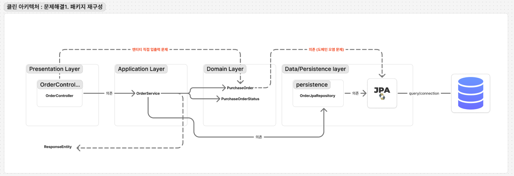
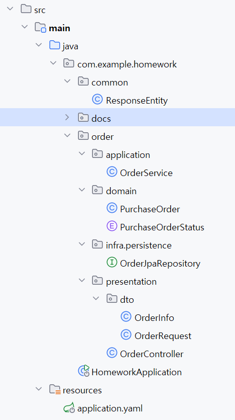
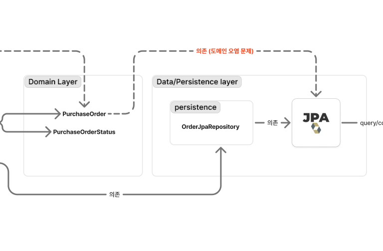
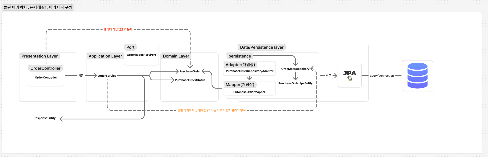

# 과제내용
### 1. 레이어드로 구현된 Order 관련 아키텍처를 DDD 구조로 변경

### 2. Payment 결제 시스템을 추가하기

---
# 문제 인식
## 1) 현재 아키텍처 구조 : 불완전한 레이어드 아키텍처

## 2) 다이어그램으로 문제 구체화화기

### 1.레이어드 아키텍처 표준 관점에서의 규율 위반

- **[문제1]** 엔티티를 컨트롤러가 직접 입/출력 하고 있는 문제
- **[문제2]** 서비스 내부에 비즈니스 흐름 뿐만 아니라, HTTP/응답 형식까지 직접 결정
  (HttpStatus.CREATED... 부분)
- **[문제3]** 도메인의 JPA 의존 문제: 도메인 모델이 "DB에 어떻게 저장되는지(JPA 매핑 규칙)"을 직접 알고 있는 상태
- **[문제4]** dto/response가 도메인 패키지에 혼재된 문제

### 2.클린 아키텍처 관점에서 레이어드가 갖는 추가 한계

- **[한계1]** 의존성 역전이 약함: Presentaion -> Service -> Repository 처럼 위에서 아래로만 의존하기 때문에 JPA 등 핵심 기술이 변하면 다 바뀌어야 하는 문제
- **[한계2]** 유즈 케이스가 불명확한 문제: 서비스 하나에 몰아넣어서 서비스가 과도하게 모든 일을 처리
- **[한계3]** 확장성/테스트성의 한계: 레이어드에선 Service가 외부 기술들을 직접 알게 되면서 바깥 기술이 안으로 스며드는걸 막기 어려움. 본 문제에서 토스 결제같은 기술을 추가할때도 문제.

---

# 문제 해결

### 1. 패키지 재구성 (도메인 중심으로 재배치)
>기존 구조는 계층 중심(controller/service/repository/entity)으로 분리되어 있어 도메인 경계가 코드에 드러나지 않고,
> DTO/Response 등 표현 계층 요소가 도메인 패키지에 혼재되어 있었다.
> 따라서 우선 Order 컨텍스트를 기준으로 패키지를 재구성하고, 그 내부를 presentation/application/domain/infra로 분리하여 도메인 중심 구조와 의존 방향을 코드 레벨에서 강제함.

  

- 의존 문제나 기타 문제들은 해결 되기 전 상황

---
### 2. 도메인이 JPA 의존하는 문제 해결 : Adapter, Mapper 구현

**위의 그림과 같이 코어에 해당하는 도메인 레이어에 속한 PurchaseOrder가 외부 기술은 JPA에 의존적인 상황을
해결해야 했음**

**1) PurchaseOrder에 JPA관련 어노테이션 제거 및 순수 비즈니스 로직만 넣어놓기(도메인 엔티티)**

**2) JPA엔티티는 따로 PurchaseOrderJpaEntity로 분리하기 (infra)**

**3) 도메인 엔티티를 연결하는 어댑터+매퍼 만들기 (SRP 단일 책임 원칙을 고려해서 Adapter는 "DB 저장/조회", Mapper는 "변환 규칙"으로 책임을 분리해봄, 필수는 아님)**

